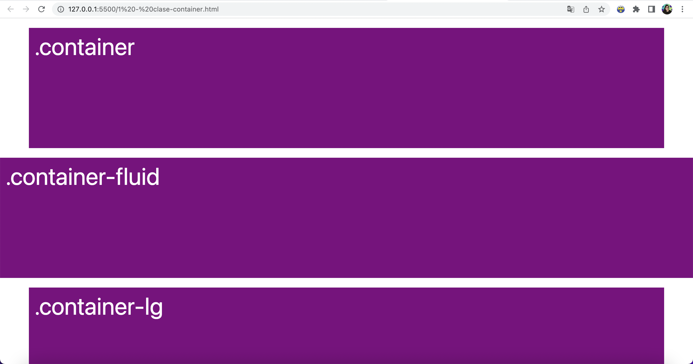
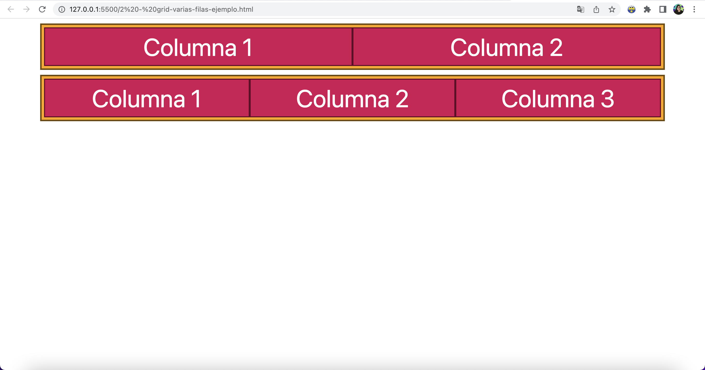
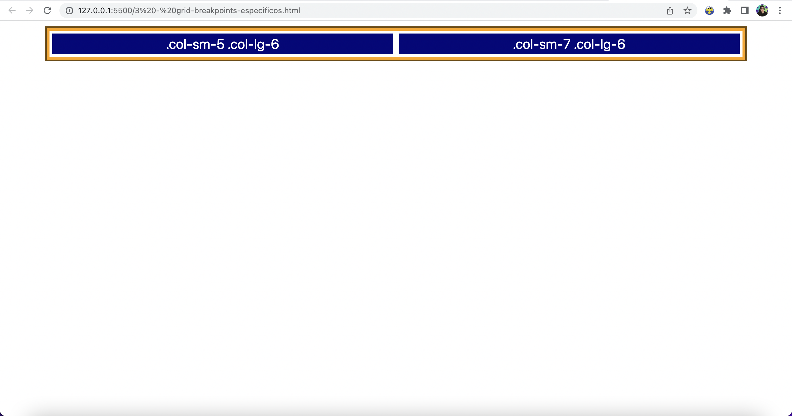
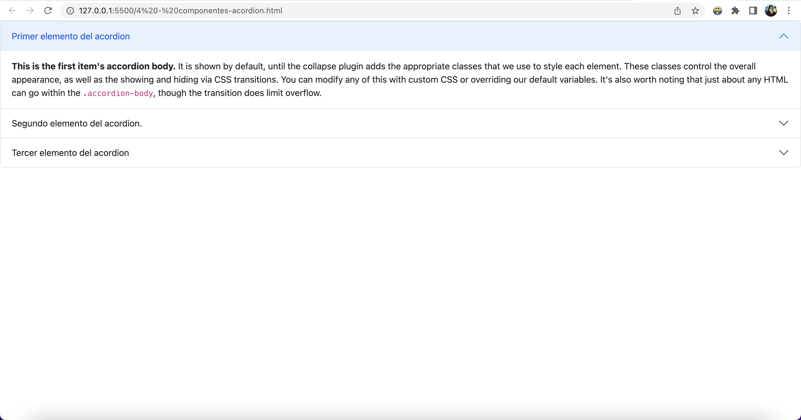
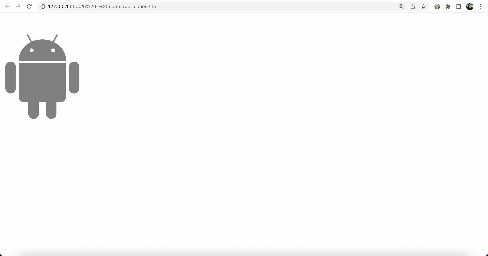

# Ejemplos de Bootstrap

En este repositorio podrás encontrar los ejemplos de Bootstrap que se muestran en el curso de Bootstrap 5 en el canal de YouTube de freeCodeCamp en Español. 

Los ejemplos incluyen:
* [Contenedores](1%20-%20clase-container.html)

* [Grid de Bootstrap](2%20-%20grid-varias-filas-ejemplo.html)

* [Breakpoints o puntos de quiebre](3%20-%20grid-breakpoints-especificos.html)

* [Componentes (Acordión)](4%20-%20componentes-acordion.html)

* [Íconos de Bootstrap](5%20-%20bootstrap-iconos.html)

## Curso en YouTube

Para ver estos ejemplos paso a paso y aprender cómo usar estos conceptos para crear una página web responsiva, te invito a tomar el curso de forma gratuita en el [canal de YouTube de freeCodeCamp en Español](https://www.youtube.com/freecodecampespanol).